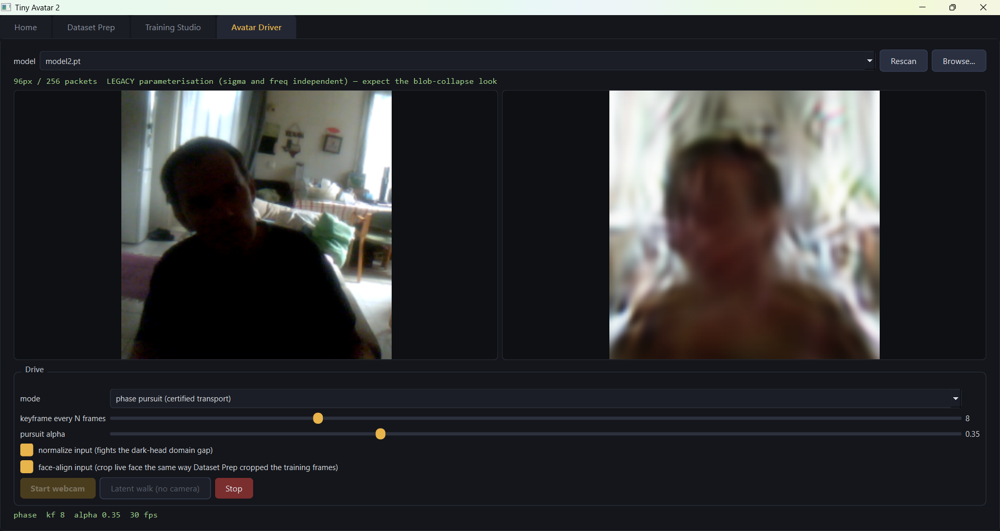
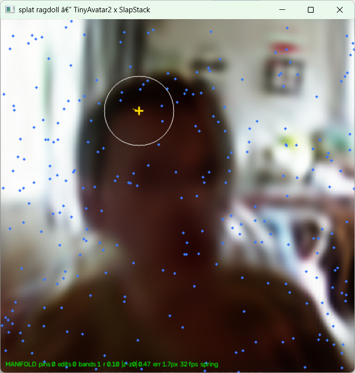
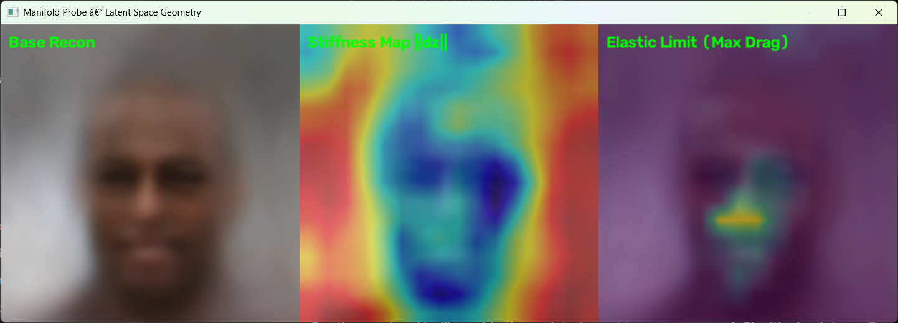

# TinyAvatar 2

EDIT: Added the TroubleShootingFaceSharpness sub folder where we thought about 
the issue. I think resolution and dataset quality has a lot to do with it. The 
model with my face had only 1900 images and was shot with crappy trust webcam 
and there were blurry images in the dataset as I turned. Larger dataset, sharp 
images. removing blurry ones. Higher resolution, would probably produce incredible 
results. 

EDIT: After training you have to re start the software to drive a model. 
Else you get the cpu \ gpu conflict. 



A generative face model built out of nothing but wave interference — plus the
trainer, the studio that drives it, and two tools that came out of asking what
else the thing can do:

- **`splat_ragdoll.py`** — grab the face with the mouse and pull it. The rest
  of the head follows along the learned manifold.
- **`manifold_probe.py`** — the same drag, pointed inward. Sweep it over a grid
  and it measures the *shape* of what the model learned.
- **`pin_driver.py`** — drive the avatar from webcam landmarks through the
  decoder Jacobian instead of the encoder, restricted to the compliant
  subspace.

A VAE maps a 128-dimensional latent to a few hundred **Gabor wave packets**
(oriented sinusoids under Gaussian envelopes). The image is their additive
interference on the canvas. No pixels are stored and there are no
convolutions in the decoder — the face *is* the interference pattern.

> Do not hype. Do not lie. Just show.

---

## Install

Python 3.10+ (3.13 is what this is developed on). An NVIDIA GPU is needed for
training; the ragdoll, the probe, and the gates run fine on CPU at 96px.

```bash
git clone https://github.com/anttiluode/TinyAvatar2.git
cd TinyAvatar2
pip install -r requirements.txt
```

That installs a **CPU-only** torch. For training, replace it with a CUDA build
from pytorch.org — for CUDA 12.1:

```bash
pip install --force-reinstall torch --index-url https://download.pytorch.org/whl/cu121
python -c "import torch; print(torch.__version__, torch.cuda.is_available())"
```

Optional: `pip install mediapipe` upgrades pin driving from 2 landmarks (pose
only) to 8 (pose **and** expression). Everything works without it.

| you want to run | you need |
|---|---|
| `splat_ragdoll.py`, `manifold_probe.py`, `pin_driver.py` | torch, numpy, opencv-python |
| `splat_trainer5.py` (training, audit, compare) | torch, numpy, opencv-python |
| `tiny_avatar4.py` (Qt studio + webcam driver) | the above **plus PyQt6** |
| `spectrum_audit.py` | numpy, and either opencv-python or Pillow |

`psutil` and `pynvml` are optional — they only feed the studio's RAM/VRAM
meters and every call site is inside a `try/except`.

**All the python files must sit in one directory.** `splat_ragdoll.py` imports
`splat_trainer5.py`, which imports `splat_trainer3v2.py` for `Encoder`,
`Decoder`, and the dataset cache; `pin_driver.py` imports both. If
`splat_trainer3v2.py` is missing, `splat_trainer5.py` still runs `--smoke` but
dies on the first real command with `TypeError: 'NoneType' object is not
callable` — that is the missing import, not a bug.

Verify:

```bash
python splat_ragdoll.py --selftest         # 5 CPU checks, no model, no data
python pin_driver.py    --selftest         # 4 CPU checks + a negative control
python splat_trainer5.py --smoke           # 21 CPU checks, no data
python splat_ragdoll.py --model model2.pt  # the included checkpoint
```

---

## Play with it now

A legacy checkpoint (`model2.pt`, 96px / 256 packets) is included so you can
try everything without training.

```bash
python splat_ragdoll.py --model model2.pt          # the ragdoll
python splat_ragdoll.py --gates --model model2.pt  # the science run
python manifold_probe.py --model model2.pt         # the stiffness map
python pin_driver.py --model model2.pt             # webcam pin driving
```

### What you are doing when you drag

**MANIFOLD mode** (default). A click grabs a soft cluster of packets
(amplitude × envelope × grab-radius weighted); dragging creates a *pin*. The
app then solves, live,

```
min_z  Σ_i || centroid_i(z) − target_i ||²    (+ identity bias)
```

by damped least squares on the decoder Jacobian ∂c/∂z — a (2m × 128)
Jacobian for m pins, so the per-iteration solve is a tiny (2m × 2m) system.
The identity-retention pull toward the anchor face is applied in the **null
space** of the pin Jacobian (the standard secondary-task trick from robot
IK): pins are honored exactly, and the face relaxes back toward itself only
in directions the pins don't constrain. The VAE's learned covariance is the
rig. There is no skeleton, no blendshapes, no weight painting — if the
training data correlated two features, pulling one drags the other.

It does not feel like a ragdoll. It feels like pulling gas. That is the
compliance being read through your hand: hundreds of packets each moving a
little, because the latent has many cheap directions there. A stiff region
feels like a spring instead.

**DIRECT mode** (`m` to toggle). The same grab, applied straight to the
activated packet parameters after the decoder: rigid SE(2) translate, rotate
(`,` / `.`), and a scale gesture (`<` / `>`) that preserves constant-Q
**exactly** — σ scales up, carrier frequency scales down, Q = σ·f invariant
to machine precision. No solver, no manifold; parameter-space surgery.
Keys `1`–`5` gate octave bands out of the grab.

Other keys: `p` persistent pin · `c` clear · `[` `]` grab radius · `s`
spring-back · `w` wobble (latent velocity) · `b` bake as new identity ·
`r` reset · `n` new random identity · `--image me.png` · `--record out.mp4`.

### The ragdoll gates, measured



"Pull one eye and the head moves with it" is a registered gate (RG1), not
marketing. Drag a pin at the left-eye region by +0.08 in x, solve to
tolerance, measure how far the **un-pinned** mirror cluster moved — against a
direct-mode control, which moves only the grabbed weights.

| model | RG1 mirror motion | direct control | ratio (gate ≥ 3×) | verdict |
|---|---|---|---|---|
| `model5_constQ.pt` (128px/512, constant-Q) | 9.7 px | 0.2 px | **9.7×** | [V] |
| `model2.pt` (96px/256, legacy, own-face) | 6.2 px | 0.04 px | **6.2×** | [V] |
| `model2.pt` (96px/256, legacy, CelebA-30k) | 4.4 px | 0.01 px | **4.4×** | [V] |

Negative control, found for free: on a **random-weight** decoder the same gate
returns ratio 0.41 — **[K]**. The machinery cannot pass its own gate; a pass
is the trained manifold talking, not the solver flattering itself.

RG4 ramps the drag from 0.02 to 0.30 and logs pin error, ‖z‖, and moiré. The
three models answer differently, and the difference is the most interesting
number in the run:

- The **CelebA model refuses the pin**: error climbs to 13.6 px while moiré
  stays ≈ 0. A *stiff* manifold — it would rather miss your target than leave
  the data distribution. (This is also why webcam driving worked out of the
  box: the manifold hosts poses directionally.)
- The **constant-Q model obeys the pin** all the way out and pays in moiré
  (0.48 by drag 0.20). A *compliant* manifold — it follows you off the
  distribution and shatters there.
- A model trained on ~1900 frames of one person sits between: you can drag
  that person around and the non-moving parts hold still.

Stiffness versus compliance of a learned manifold, measured with a mouse.

Honest caveats: RG2 (nullspace identity retention) passed 0.84 on one model
and returned "no converged pairs" on two — the convergence tolerance is too
tight for those, which is a limitation of the gate, not a pass. RG3 (≥ 20 FPS)
failed on the 128px model because the app is **CPU-only**; 96px runs at ~59
FPS on CPU. And the grab is spatial soft-selection at a chosen radius and
band — the model has **no learned hierarchy** (see the tree section), so
"grab the eye" means "grab what is painted there", nothing more.

---

## The manifold probe



Same drag, pointed inward. `manifold_probe.py` sweeps pins over a grid and
records, per location, the latent cost ‖dz‖ per unit drag (**stiffness**) and
how far you can pull before moiré crosses threshold (**elastic limit**).

The picture above is the first result and it says something the ragdoll alone
never showed:

**The face is soft and the frame is hard.** Stiffness is blue across the head
and red everywhere around it. The latent controls the face and barely controls
anything else — moving a cheek packet is cheap in z, moving a background
packet costs enormously or fails. Nobody trained that in. It means the model
has already separated subject from scenery, not as a segmentation mask but as
a mechanical property. It is also why dragging the face does not drag the wall
along with it: the solver would have to pay for that, so it doesn't.

**The two maps disagree, and that is information.** Stiffness says the whole
face is cheap. Elastic limit says almost none of it has range — except a
bright streak at the mouth and some around the eyes. Cheap-to-nudge and
far-to-travel are different quantities. On a CelebA-style set, mouths open,
close and smile across 200k images so the mouth has manifold room, while head
position is roughly registered across the set so it does not. A single-identity
model should invert part of that; one command tests it.

Read the current script's numbers with these limits in mind, because they are
real:

- **n = 1.** One `z0`, one seed. The maps describe the neighbourhood of a
  single point in latent space, not the model.
- **`cv2.normalize(..., NORM_MINMAX)`** rescales each panel to its own range,
  so **two models cannot be compared** as shipped — the colours would mean
  different things. A shared absolute scale is needed for that, which is the
  main use the probe exists for.
- The solver runs `iters=10` with `step_clip=0.5` and never checks `err`, so
  red may be **clip saturation** (a ‖dz‖ ceiling of 5.0, i.e. stiffness 100)
  rather than a magnitude. Check with
  `print(stiffness_map.max(), (stiffness_map > 99).mean())`.
- It is a 16×16 grid bilinearly upsampled to 512. The smooth organic look is
  interpolation over 256 real samples.
- The drag is +x only. The honest object is a 2×2 metric tensor per location;
  anisotropy is unmeasured.
- The **coupling field** — drag here, what else moves — is not in this version.
  That is the panel that would draw RG1's 4.4–9.7× as an arrow field.

---

## Pin driving

`pin_driver.py`, and the **pin driving** checkbox in the studio's Avatar
Driver tab (off by default).

The shipped driver goes `frame → conv encoder → z → render`. That path has a
measured defect: the encoder is translation-invariant — a 28 px slide of the
input moves the reconstruction 0.5 px — and it is appearance-based, so over a
session z wanders into directions that change how the face *looks* without
changing where anything *is*. That is the appearance decay: geometry holds,
sharpness and colour rot toward the dataset mean.

Pin driving takes the other route. Webcam landmarks become pins, and z is
solved so the rendered feature positions match them, using the ragdoll's DLS
latent IK. The decoder Jacobian is the correct operator for "move this feature
there"; the encoder is not.

**The stiffness mask, applied as a subspace.** You cannot mask a 128-D latent
update with a 2-D picture, so it isn't applied as one. `build_control_basis()`
stacks the Jacobian rows ∂(centroid)/∂z over a grid of face-region grab points,
projects out the directions that move a background ring, and takes the top-k
right singular vectors. Driving then happens in

```
z = z_anchor + V @ a        V: (128, k) orthonormal,  a: (k,)
```

so stiff, background, and non-facial directions are not penalised — they are
**unreachable**. Identity is preserved by construction outside `span(V)` and by
a nullspace pull toward `a = 0` inside it. The singular spectrum is printed on
startup and is a direct count of how many latent directions actually move the
face; on a model with diversity collapse it falls off a cliff and you can see
where.

Landmarks: **haar** always (ships with opencv, 2 eye pins — pose only) or
**mediapipe** if installed (8 pins — pose and expression). Pins are read in the
`FaceFramer` crop, the same 0.35-margin framing Dataset Prep used. Consequence,
stated plainly: because the crop tracks the face, global head translation is
mostly removed before the pins are read. That is correct rather than a
limitation — the training frames were face-cropped too, so the manifold barely
contains global translation and a model asked to put a face in the corner has
never seen one.

### Pin-driving gates

```bash
python pin_driver.py --selftest
python pin_driver.py --gates --model model2.pt
```

| gate | claim | status |
|---|---|---|
| PD0a | basis orthonormality ‖VᵀV − I‖ < 1e-5 | **[V]** |
| PD0b | structural containment: `(z − z_anchor)` has zero component outside `span(V)` | **[V]**, 8.9e-08 |
| PD0c | reduced solver reaches a reachable pin within 1.5 px | **[V]**, 2 iterations |
| PD1 | background motion under pin driving ≤ 0.60 × full-128-D driving | registered, **run it on your model** |
| PD2 | full loop ≥ 30 FPS | registered, machine-dependent |
| PD3 | identity retention beats encoder driving over a live session | **unmeasured** |

PD1 has a negative control built in: on a random-weight decoder the ratio sits
near 0.8 and the gate fails, because a structureless decoder has no
subject/frame separation for the subspace to find. It is not passable by
machinery alone.

PD3 is the claim this whole file exists for, and it is the one that has not
been measured. The mechanism argument is sound and the encoder's
translation-invariance is measured, but "pin driving fixes appearance decay"
is a hypothesis until a session log says otherwise. In the live driver press
`e` to A/B against encoder driving, and `f` to A/B the compliant subspace
against full 128-D.

Live keys: `c` recalibrate · `f` mask on/off · `e` encoder on/off ·
`[` `]` gain · `-` `=` damping · `o` overlay · `r` reset · `q` quit.

---

## The size, honestly

The old headline said "~7 MB model". A shipped training checkpoint measures
**96 MB**. Both are real; they measure different things.

| piece | 96px/256 line | 128px/512 line |
|---|---|---|
| decoder (z → packets) — *the generator* | **7.1 MB** | 12.9 MB |
| renderer | 0 learned parameters (buffers only) | 0 |
| encoder (image → z) | 15.9 MB | 19.5 MB |
| all weights | 23.0 MB | 32.4 MB |
| training checkpoint on disk (+ Adam moments, 2 extra copies of every weight) | ~69 MB | **~97 MB** |

The thing that *generates* a face from a 128-float latent is the 7 MB decoder
plus a parameter-free renderer. The 96 MB file additionally carries the encoder
and the optimizer state needed to resume. To ship inference-only:

```python
import torch
ck = torch.load("model5_constQ.pt", map_location="cpu", weights_only=False)
ck.pop("opt", None); ck.pop("sched", None)
torch.save(ck, "model5_constQ_infer.pt")     # ~32 MB, loads identically
```

Per-frame state is still 128 floats regardless of any of the above.

---

## The main science: constant-Q

### The old models had abandoned their own carrier

A Gabor packet's character is captured by `Q = sigma * freq` — cycles of
carrier across one envelope sigma. `splat_trainer3v2` sampled sigma and freq
independently, so the model could pick any Q. Measured on the shipped
`model2.pt`: **median Q = 0.22**, under half a cycle across the visible
envelope, with zero packets above Q = 1.5. The trained basis was a mixture of
signed Gaussian *blobs*, not a Gabor frame. That is the blur — one Gabor can
represent an edge; one blob cannot.

This falsified the hypothesis the trainer was written to test (that moiré came
from *too much* Q; it was the opposite regime), so the coupling was inverted
from a ceiling into a **floor**:

```
sigma = clamp( (q / freq) * exp(q_slack * tanh(raw)), sig_lo, sig_hi )
```

With `q = 0.6` and one octave of slack, Q is confined to roughly [0.3, 1.2] —
blob collapse is forbidden and every packet must oscillate.

### The result, in a matched comparison

96px / 256 packets, 1937 own-face images, 3000 steps per arm, everything else
identical:

| gate | constant-Q | legacy |
|---|---|---|
| **Q2 PRIMARY** — PSNR, eval mode | **14.39** | 12.70 |
| Q2 — PSNR, batch statistics | **14.38** | 12.70 |
| Q1 — moiré index | **0.0003** | 0.0132 |
| Q3 — beat, overlap-normalised | **0.4217** | 0.6447 |
| Q4 — median Q | **0.49** | 0.42 |

Forcing carrier use bought **+1.7 dB** and cut invented mid-band structure
44-fold. PSNR is reported in both BatchNorm modes because running statistics
are poorly estimated at 3000 steps and can fake a gap alone; the modes agree to
0.01 dB. **Honest scope:** one dataset, one identity. The supported claim is
"constant-Q beat legacy here", not "constant-Q is better".

### The octave ladder, and the hole it once had

Constant-Q has a consequence: the sigma ceiling sets a **carrier floor**
(`freq >= q/sig_hi`). An earlier build parked carrier-free "gist" Gaussians at
f = 0 while carriers started at 5 cyc/img — so nothing represented (0, 5),
which on a face is the head outline and feature layout. It rendered as frosted
glass plus fine stripes. The fix was one continuous constant-Q family from
f = 1 to Nyquist/2. At 128px / 512 packets:

```
   1 -  2 cyc/img   103 packets   sigma 0.300-0.600   head outline / lighting
   2 -  4 cyc/img   102 packets   sigma 0.150-0.300
   4 -  8 cyc/img   103 packets   sigma 0.075-0.150   feature geometry
   8 - 16 cyc/img   102 packets   sigma 0.037-0.075
  16 - 32 cyc/img   102 packets   sigma 0.019-0.037   fine texture
```

The band → packet-index map is a **recorded checkpoint key** (`band_mode`),
because changing it changes every packet's frequency range while the
state_dict shape stays identical: a striped-trained model rendered by
interleaved code produces 0.98 max absolute error on a 0–1 image, silently.
Old checkpoints load as `striped` and render bit-identically. New runs default
to `permute`. For the same reason, **every consumer must load through
`load_splatvae()`** — constructing the model from (image_size, num_packets)
alone renders legacy checkpoints with wrong formulas at up to 0.57 max error,
with no exception raised.

### The dyadic tree that did not work

The natural next idea was a bifurcating quadtree — parents spawn four children
at double frequency and half sigma (Q preserved), children pinned inside the
parent envelope. Because that geometry is fixed, coefficient fitting is linear
least squares — an upper bound on what any trainer could reach with it,
computable in seconds, *before* spending GPU time:

| basis (matched N = 341, 4 seeds) | lsq PSNR | beat, normalised |
|---|---|---|
| tree, uniform subdivision | 23.44 ± 0.67 | 0.724 |
| tree, residual-driven splitting | 21.68 ± 0.57 | 0.732 |
| **flat basis, same octave histogram** | **22.55 ± 0.24** | 0.725 |

The adaptive tree is 0.87 dB **worse** than a flat basis that merely copies its
histogram, and beat did not drop — pinning children inside parents relocates
fringes among siblings rather than killing them. Everything the tree bought was
the histogram. Not built.

---

## Files

| file | what it is |
|---|---|
| `splat_ragdoll.py` | **the ragdoll.** Latent IK + SlapStack-style direct editing on any checkpoint. `--selftest`, `--gates`, `--record` |
| `manifold_probe.py` | **the probe.** Stiffness and elastic-limit maps of a trained manifold |
| `pin_driver.py` | **pin driving.** Landmarks → decoder Jacobian → z on the compliant subspace. `--selftest`, `--gates` |
| `splat_trainer5.py` | the trainer. Constant-Q renderer, Q1–Q4 gates, `--audit`, `--compare`, `--resume`, CPU `--smoke` |
| `tiny_avatar4.py` | the studio. Dataset prep, training, webcam driver (encoder or pin) |
| `splat_trainer3v2.py` | legacy trainer; supplies `Encoder`/`Decoder` and the data cache. Required |
| `spectrum_audit.py` | diagnostic: finds your dataset's sensor-noise knee to pick `--f_max`. Optional |
| `model2.pt` | legacy 96px/256 checkpoint, included so you can play immediately |

## Run order

```bash
python splat_ragdoll.py --model model2.pt              # play first
python splat_trainer5.py --smoke                       # 21 CPU checks, no data
python splat_trainer5.py --compare --data_dir faces1 --steps 3000
python splat_trainer5.py --data_dir faces1 --out runs/hq \
       --image_size 128 --num_packets 512 --detail 1.0 --steps 30000
python splat_trainer5.py --audit runs/hq/model5_constQ.pt
python splat_ragdoll.py --gates --model runs/hq/model5_constQ.pt
python manifold_probe.py --model runs/hq/model5_constQ.pt
python pin_driver.py --gates --model runs/hq/model5_constQ.pt
python tiny_avatar4.py                                 # studio + webcam
```

Budget honestly: 30000 steps × batch 32 ≈ 960k images ≈ **7 hours** at
~38 img/s on a 12 GB 3060, not fifteen minutes. Turn **checkpointing on** for
128px/512 — without it the forward pass thrashes VRAM and the first log line
can take half an hour to appear.

## Driving the avatar (webcam)

Between encoder keyframes, packets glide along the complex-phasor geodesic
rather than crossfading — a linear crossfade drives the field amplitude to
exactly zero at the midpoint (a flat grey frame); phase transport holds
amplitude flat and preserves edges. It passed a registered 8-pair gate. Modes:
**phase** is certified; **lerp** is the baseline it beat; **direct**
re-encodes every frame; **screw** and **dispersion** are uncertified demos and
labelled that way. Two practical things that matter more than any of it: frame
your live face the way Dataset Prep framed the training frames (Haar crop,
0.35 margin — the "face-align input" toggle does it live), and keep beta low.

Pin driving is the alternative to all of the above and is described in its own
section.

---

## Honest revisions log

Things that were believed and then measured otherwise. Kept because the
retraction is part of the result.

1. **"High Q causes the moiré."** Falsified by `--audit`: median Q was 0.22 —
   the opposite regime. The trainer's purpose inverted from ceiling to floor.
2. **"Q1 (moiré) is the headline gate."** Demoted: moiré also goes to ~0 for
   maximal blur, since it counts *invented* energy. Q2 became primary.
3. **"Raw beat_index compares arms."** No — confounded by envelope size. Arms
   compare on the overlap-normalised version only.
4. **"A carrier-free gist band gives us the low frequencies."** It opened the
   spectral hole instead. Dropped.
5. **"Equal-per-octave allocation is worth +6.8 dB."** Retracted — the trainer
   already allocated equally; the sweep was against a straw man that does not
   correspond to this code. A smoke test now asserts the split.
6. **"The dyadic tree is the next architecture."** Pre-tested by least squares;
   lost to a flat basis with its own histogram. Not built.
7. **"Lateral inhibition is the missing anti-moiré fix."** There is no moiré
   left to fix (0.0003 vs 0.0132), and a render-time divisive gain is cancelled
   by the optimizer rescaling coefficients. This is a synthesis system, not an
   analysis system; there is no population to normalize.
8. **"~7 MB model."** Imprecise. The *decoder* is 7.1 MB on the 96px line; the
   renderer has zero learned parameters; the shipped checkpoint is ~96 MB
   because it also carries the encoder and two Adam moment copies. See the size
   table. Per-frame state remains 128 floats.
9. **"Pull one eye and the head turns with it."** Was a hope; is now a measured
   result — RG1 passed at 9.7× / 6.2× / 4.4× across three models, against a
   control and a negative control. This one survived contact with the gate.
   They don't all die.
10. **"The background splats will be a mess."** They aren't, and the probe says
    why: the background is *stiff*. The latent spends its degrees of freedom on
    the face and treats the frame as near-fixed scenery. The separation was
    already there; nothing had ever looked for it.

## Not certified

Named plainly so nothing here gets read as a result: `screw` and `dispersion`
pursuit modes; the cross-model phase-binding matrix; webcam mode on any machine
but the one it was written on; RG2 on the two models where it did not converge;
ragdoll and pin-driver frame rates on GPU (both are CPU-only as shipped); PD1
and PD2 on any trained model until you run them; **PD3 entirely** — pin driving
is *argued* to fix appearance decay and has not been *measured* to; every
caveat listed in the manifold-probe section; and any claim about datasets other
than the ones in the tables.
