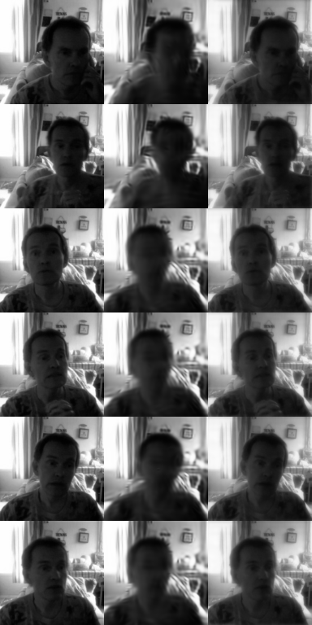
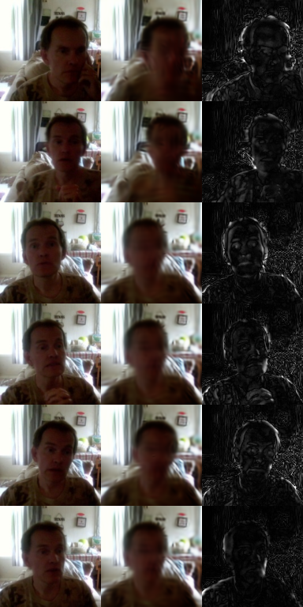

# TroubleShootingFaceSharpness



EDIT: A thing that was not discussed was. The training data of my face was 
shot with crappy trust webcam and looking at training images, there are blurry 
images. I think that has lot to do with the results. So dataset quality and resolution 
are very important. But yes, this went into looking at the blurriness. 

Diagnostic tools and the full measurement ledger for one question:

> `model5_constQ.pt` renders the room sharply and the face as a soft mass.
> Why?

Five hypotheses were proposed, each one plausible, each one killed by a
measurement. This folder contains the instruments, the numbers, and the
retractions. Nothing here is a fix — it is the record of how a fix was
looked for.

**Do not hype. Do not lie. Just show.**

---

## The observation



`model5_constQ.pt` — 128px, 512 packets, constant-Q q=0.6, 5 octaves,
f_max=32, `band_mode=permute`, `splat_trainer5`, ~45k steps overnight on
~1900 own-face webcam frames (full frame, the room is in shot).

A **direct reconstruction of a training frame** — no camera, no pursuit
smoothing, pins 0, `|z-z0| 0.00` — renders the room's curtain folds, picture
frame and table edge, and renders the head as a dark featureless mass.

That first check mattered: it exonerated the live driver, the domain gap and
the pursuit blending before any of them could absorb the blame.

---

## The ledger

| # | Hypothesis | Verdict | The number that killed it |
|---|---|---|---|
| FS1 | The face is a small, low-contrast minority of the available signal | **[K]** | Interior detail-energy share 4.59% on 2.33% of canvas = **1.97× its fair share** |
| FS2 | The face is backlit and underexposed, so it holds little contrast | **[K]** | Mean \|∇I\| ratio inside/outside **1.619**; luminance mean 0.488 in vs 0.403 out |
| FS3 | The optimizer starves the face relative to its stake | **[K]** | Region-matched residual share 40.88% vs detail share 40.68% = **ratio 1.00** |
| FS5 | The model is band-limited — it drops the top octaves everywhere | **[K]** | Capture per octave **0.999 / 0.993 / 0.979 / 0.942 / 0.861**, no cliff |
| FS6 | High frequencies are missing *specifically* over the face | **[K]** | In/out capture ratio **1.00 / 1.00 / 1.00 / 1.00 / 0.93** |
| FS7 | The decoder collapses distinct poses onto a conditional mean | **[K]** | Median RMS input pairs 0.3198, recon pairs 0.3037 = **ratio 0.988** |
| FS9 | The residual softness is all there is (at the information ceiling) | **OPEN** | See below |

Supporting measurements:

```
overall MSE 0.001485   PSNR 28.28 dB (eval) / 28.32 dB (batch-stat)
MSE inside moving region 0.003118, outside 0.001090
per-octave power share  79.9 / 15.2 / 3.8 / 0.84 / 0.19 %
silhouette carries 88.8% of the face region's detail energy
```

### FS8 / FS4b — the degrees-of-freedom question

```
DATA effective rank over the face interior     1.8  (200 frames) / 1.9 (64)
  singular values  72.3  21.1  9.8  9.2  5.8  5.5  3.9 ...   2 dims to 90%

MODEL effective rank at real encoded latents   1.0 - 1.4  (median 1.1)
  1 dim to 90% at every sample; the origin z=0 gives the same answer
```

The footage has roughly **one dominant mode** of face variation, which matches
how it was captured — sitting still, small head movement, opening the mouth.
The model carries about that much.

Pre-registered gate: `data > 2.0 × model` would mean the model is discarding
DOF the data has. 1.9 vs 1.1 is **1.7×**, under the gate — but it is a 42%
shortfall and the 2.0 threshold was a guess made before any data. It is close
to the line, not comfortably past it.

### The |z| reconciliation

Two measurements appeared to contradict each other and do not:

| source | quantity | value |
|---|---|---|
| `splat_ragdoll --gates` RG4 | `\|z\|` | 9.92 – 10.57 |
| `face_dof.py` FS4b | `\|mu\|` | 0.86 – 2.28 |

RG4's `z` is **sampled** — `mu + sigma*eps` — and in 128 dimensions the
unit-variance noise alone contributes √128 = 11.3. `mu` itself is small. So the
posterior does sit near the prior. Normally that reads as collapse, except FS7
shows the reconstructions stay fully diverse, so it is not information-free.

---

## What is still open

**FS9 — the spectral twin.** Build the input with each radial band attenuated
by exactly the amount the model was measured to lose
(`a = 1 - sqrt(1 - captured)`; captured 0.825 → amplitude gain 0.582), then
compare that twin against the model's actual reconstruction.

- `MSE(twin, recon) << MSE(recon, input)` → the softness is the whole story,
  nothing is misplaced in space, the model is at its information ceiling for a
  128px canvas.
- `MSE(twin, recon) ~ MSE(recon, input)` → there is spatial or phase error the
  radial spectrum averages away, and the search is not over.

`ceiling_strip.png` (input | recon | twin) appears by eye to show the twin
noticeably sharper than the reconstruction, which would mean **[K]**. That is
an eyeball, not a measurement. **The printed ratio is the gate.** Until it is
recorded here, the "at the ceiling, capture more footage" conclusion is a
hypothesis and not a result.

**A known limitation of FS6.** The inside/outside spectra are computed through
a tapered soft window. The window has its own spectral width, which smears the
bands it is measuring. If FS9 comes back [K] while FS6 says the face is treated
identically to the background, suspect window leakage before believing FS6.

---

## Files

| file | the question it was built to answer |
|---|---|
| `face_budget.py` | Does the face region get any share of the *available* signal? (FS1, FS2, FS3, FS5) plus `--coverage`, the octave-coverage arithmetic |
| `face_dof.py` | How many degrees of freedom does the face have, in the data and in the model? (FS6, FS7, FS8, FS4b) |
| `sharpness_ceiling.py` | Is the remaining softness all there is? (FS9, FS10) |

`face_dof.py` and `sharpness_ceiling.py` import from `face_budget.py`. Keep all
three in the same folder, alongside `splat_trainer5.py`.

Every script has `--selftest`, and every selftest is **two-sided**: the gate
must fire on a planted positive and must *not* fire on a planted negative. A
gate that only fires is not a test.

```
face_budget.py       7 checks   ALL [V]
face_dof.py          5 checks   ALL [V]
sharpness_ceiling.py 3 checks   ALL [V]
```

---

## Run order

```bash
python face_budget.py --selftest
python face_budget.py --coverage
python face_budget.py --stats --data faces1 --n 300
python face_budget.py --recon --data faces1 --n 64 --model runs/tiny2/model5_constQ.pt

python face_dof.py --selftest
python face_dof.py --data faces1 --n 200                       # FS8, no model
python face_dof.py --data faces1 --n 64 --model runs/tiny2/model5_constQ.pt

python sharpness_ceiling.py --selftest
python sharpness_ceiling.py --data faces1 --n 64 --model runs/tiny2/model5_constQ.pt
```

Outputs: `var_map.png`, `mask_*.png`, `recon_strip.png`, `ceiling_strip.png`.
**Look at the masks before believing any number.** If the region lands on a
bookshelf the whole report is noise.

### Region definition

Two regions are supported. `--box x0,y0,x1,y1` is a manual face box. Otherwise
the region is **per-pixel temporal variance** over the dataset, thresholded and
morphologically closed — which needs no Haar cascade xml (missing on Windows
Store Python) and is arguably the better mask anyway, since it *is* the region
the latent has to explain.

Both are reported as a full region and an eroded interior. **The interior is
what is gated**, for a reason in the revisions log below.

---

## The octave coverage arithmetic

Pure arithmetic on the basis parameters, no data and no model:

```
128px, 512 packets, 5 octaves, q=0.6, f 1-32; sigma = q/f; 102 packets per band

   band (cyc/img)   sigma_px   footprint px^2   expected areal cover
     1.0 -  2.0      54.31       37059.7            100.0 %
     2.0 -  4.0      27.15        9264.9            100.0 %
     4.0 -  8.0      13.58        2316.2            100.0 %
     8.0 - 16.0       6.79         579.1             97.3 %   (83.5% at f=16)
    16.0 - 32.0       3.39         144.8             59.4 %   (36.3% at f=32)
```

`cover = 1 - exp(-n*area/canvas)` for random placement with overlap.

**Octave 5 physically cannot blanket a 128px canvas.** This is true and it is a
real ceiling — but FS5 and FS6 both say it is *not* what is limiting this
particular model. It is a wall you have not reached yet, not the one you are
standing at. Worth remembering before spending compute on 1024 packets.

Note also what the arithmetic says about cropping: a tight crop does **not**
raise octave 5's coverage number. What it does is move face features *down* the
ladder — a lip contour 2px wide at full frame becomes 6px wide at 3× zoom, which
puts it in octave 3 or 4, where coverage is already 100%.

---

## Honest revisions log

1. **"Your face is backlit — light it."** Wrong. FS1/FS2 measured the face as
   *brighter* than the room (0.488 vs 0.403) and *busier* (gradient ratio
   1.619), with near-full dynamic range. The advice was confident and
   unmeasured.

2. **FS1 v1 measured the silhouette, not the face.** On the selftest synthetic,
   **99.85% of a face box's detail energy sat in the boundary rim** and 0.15% in
   the interior — a head against a bright window is an enormous edge, and that
   edge is inside any box you draw. The gate was failing its own positive
   control. Fixed by eroding the region and gating the interior. The threshold
   was **not** moved; the metric was wrong, not the gate.

3. **FS3 v1 was region-mismatched.** It compared the residual share of the
   *full* mask against the detail share of the *eroded interior* and reported a
   spurious [V]. Region-matched, the ratio is 1.00 and the gate is [K].

4. **"The model is band-limited."** The coverage arithmetic is correct and the
   inference from it was not. FS5 measured 0.861 capture in the top octave —
   no cliff — and FS6 measured the face and background as equally served.

5. **FS4 v1 probed the Jacobian at z = 0**, the origin of the prior, while real
   encodings sit elsewhere. The caveat was right in principle and immaterial in
   fact: FS4b at real latents returned the same rank. Recorded because the
   *reasoning* was unsound even though the number survived.

6. **"Background effective rank 12.5, for scale"** is meaningless and should be
   ignored. The background is static, so its variance is sensor and JPEG noise,
   and noise is full-rank. That line compares a structure count against a noise
   count.

7. **The motion mask is a rim detector without morphological closing.** A moving
   head puts its temporal variance on the silhouette, not on the cheek, so raw
   thresholded variance leaves nothing to erode. `--motion_close` fills it.

8. **`ndarray.ptp` was removed in numpy 2.x.** Same trap as in `splat_field`.
   Use `np.ptp(x)`.

9. **`SplatVAEQ` has no `.forward()`.** It is `enc(x) -> mu`, `dec(z) ->
   packet parameters (N,11)`, `ren(params) -> image`. v1 of the Jacobian probe
   treated `dec()`'s output as an image and crashed with an `IndexError` on
   axis size 11 vs 16384 — which is how the API got established.

---

## What these tools do NOT establish

- **Nothing here is about the driver.** All measurements are direct
  reconstructions. Pursuit smoothing, keyframe rate, the live domain gap and
  pin-driving are separate questions, deliberately excluded so the model could
  be measured alone.
- **n = 1 everywhere.** One dataset, one identity, one checkpoint, one canvas
  size. None of these verdicts are claims about the architecture in general.
- **Reconstruction is not driveability.** FS7 = 0.988 says reconstructions are
  faithful. It says nothing about whether the model is a good puppet. FS8 = 1.8
  is the number that bears on that, and one effective degree of freedom over
  the face is a limit on driving regardless of how sharp the render is.
- **FS6's window leakage is unquantified.** See "What is still open".
- **The FS8/FS4b gate threshold (2.0×) was a guess**, pre-registered but
  uncalibrated. 1.7× is a pass by a margin nobody should lean on.

---

## Where this points

With FS9 unresolved, two readings remain live and they lead different ways.

**If FS9 is [V]** — the model is at its information ceiling for a 128px
full-frame canvas. The face is ~50px wide there, which puts an eyelid line at
about 1px. No basis, latent or loss can render detail the data does not
contain. The moves are a tight crop (more pixels on the face) and footage with
real expression range (FS8 from 1.8 toward 10+).

**If FS9 is [K]** — something is being lost in *space* that every spectral and
spatial marginal so far has averaged away, and the search continues. The next
instrument would need to look at phase and local structure directly, not at
radial power.

Run it and record the number here.
